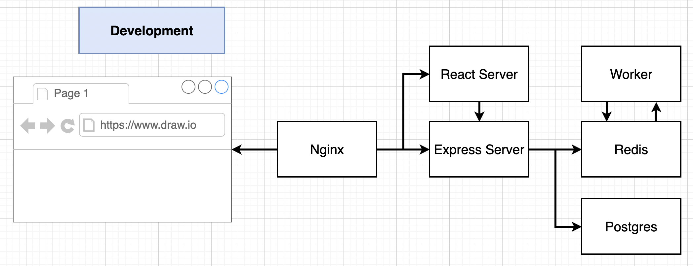
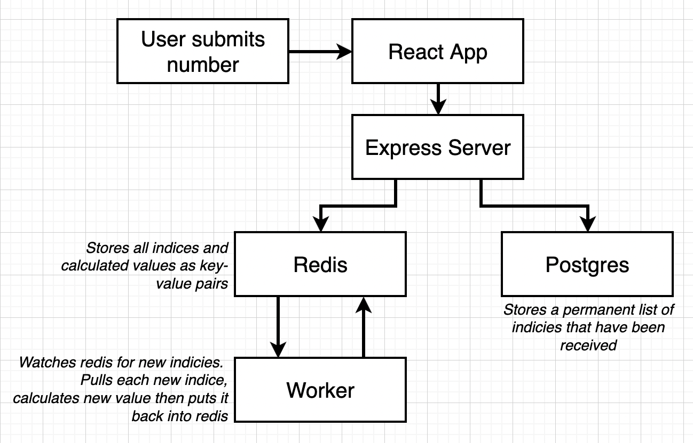
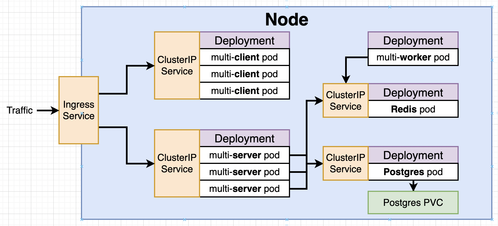
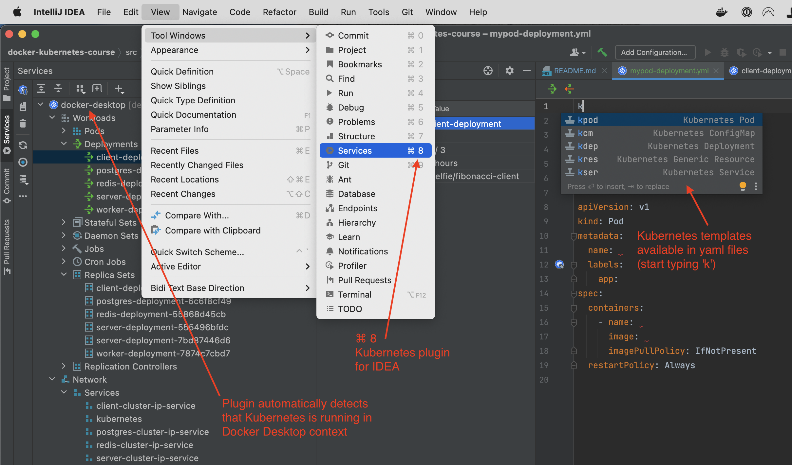

# docker-kubernetes-course
My notes of the Udemy course '[Docker and Kubernetes: The Complete Guide](https://www.udemy.com/course/docker-and-kubernetes-the-complete-guide)'

* [Reference documentation](https://docs.docker.com/reference/)
  * [Docker CLI](https://docs.docker.com/engine/reference/run/)
  * [Dockerfile](https://docs.docker.com/engine/reference/builder/) (assembling a Docker image)
  * [Compose file](https://docs.docker.com/compose/compose-file/)
* [Guides](https://docs.docker.com/get-started/overview/)
  * [Run Your App in Production](https://docs.docker.com/get-started/orchestration/)
  * [Volumes](https://docs.docker.com/storage/volumes/)
* [Manuals](https://docs.docker.com/desktop/)
  * [Docker Desktop](https://docs.docker.com/desktop/)
  * [Docker Engine](https://docs.docker.com/engine/)
  * [Docker Compose](https://docs.docker.com/compose/)
  * [Docker Hub](https://docs.docker.com/docker-hub/)


## 1. Dive into Docker

### Docker Ecosystem

* Client
* Server
* Machine
* Images
* Hub
* Compose

A Docker `Image` can be downloaded from `Docker Hub`.
A Docker `Container` is an instance of a Docker Image.

### Install Docker on macOS

Install Docker (`brew install --cask docker`) and check your installation (`docker run hello-world`).

This will install a `Docker Client` (CLI) and a `Docker Server` (Daemon)


### Namespaces and cgroups

Docker Server installs as a Linux VM. 
[Namespaces and cgroups](https://www.nginx.com/blog/what-are-namespaces-cgroups-how-do-they-work/) are used to 
isolate the processes of different Docker containers.

## 2. Docker Client: Manipulate Containers

* List all images: `docker image ls`
* List all containers: `docker ps --all`
* [Removing images and containers](https://www.digitalocean.com/community/tutorials/how-to-remove-docker-images-containers-and-volumes)
* Start shell in running container: `docker exec -it <ID> sh`

### [docker run](https://docs.docker.com/engine/reference/run/)

`docker run ` = `docker create ` + `docker start -a <ID>`
* [docker create](https://docs.docker.com/engine/reference/commandline/create/)
* [docker start](https://docs.docker.com/engine/reference/commandline/start/)

| command                  | does                                                   | example                  |
|--------------------------|--------------------------------------------------------|--------------------------|
| `docker run `       | create & start container (keep file system after exit) | `docker run hello-world` |
| `docker run <IMG_ID>`    | (you can also specify image digest instead of name)    |                          |
| `docker run --rm `  | create & start container (remove after exit)           | `docker run --rm ...`    |
| `docker run  <CMD>` | create & start container, override default command     | `docker run busybox ls`  |

Some containers exit automatically (like 'hello-world'), others keep running until you tell them to shut down (like a
typical web server).

### [docker start](https://docs.docker.com/engine/reference/commandline/start/)

| option                 | meaning              |
|------------------------|----------------------|
| `-a` / `--attach`      | attach STDOUT/STDERR |
| `-i` / `--interactive` | attach STDIN         |

You can restart an exited container with `docker start -a <ID>`.

NB: You can not specify command overrides with `docker start`. Command overrides are part of the container. Once the 
container is created, the command is fixed.

### [docker ps](https://docs.docker.com/engine/reference/commandline/ps/)

| command                               | does                                   |
|---------------------------------------|----------------------------------------|
| `docker ps`                           | list all running containers            |
| `docker ps --filter "status=running"` | list all running containers            |
| `docker ps --filter "status=exited"`  | list all containers in status 'exited' |
| `docker ps --all`                     | list all containers                    |

### [docker system prune](https://docs.docker.com/engine/reference/commandline/system/)

Removes
* all stopped containers
* all dangling images
* build cache

### [docker logs](https://docs.docker.com/engine/reference/commandline/logs/)

`docker logs <ID>` shows all the container's output (STDOUT/STDERR). Even after it exited.

### [docker stop](https://docs.docker.com/engine/reference/commandline/stop/) or [docker kill](https://docs.docker.com/engine/reference/commandline/kill/)

* `docker stop <ID>` issues a 'SIGTERM' command to the running process.
  * with `--time` you can specify #seconds after which the process should be killed (default 10 sec.)
* `docker kill <ID>` issues a 'SIGKILL' command to the running process.
  * with `--signal` you can send a custom signal to the container.

### [docker exec](https://docs.docker.com/engine/reference/commandline/exec/)

Executes a command inside a running container:

`docker exec -it <ID> <COMMAND>`

Think of `-it` as 'interactive terminal': `-i` or `--interactive` keeps STDIN open even if not attached; `-t` allocates a pseudo-TTY.

#### Getting terminal access to a container
```shell
$ docker exec -it <ID> sh
```

You can also spin up an image with the 'sh' command, but this way you're overriding your default command, so it's 
probably quite useless (unless you really just want to look around in the container, without any other process 
running in it):
```shell
$ docker run -it <NAME> sh
```

## 3. Docker Server: Building Custom Images

### [Dockerfile](https://docs.docker.com/engine/reference/builder/)

[Best practices](https://docs.docker.com/develop/develop-images/dockerfile_best-practices/)

```dockerfile
# Use an existing image as a base
FROM alpine

# Download & install dependencies
RUN apk add --update redis

# Tell image what to do when it starts as a container
CMD ["redis-server"]
```

### [docker build](https://docs.docker.com/engine/reference/commandline/build/) 
From directory where `Dockerfile` is located:
```shell
$ docker build -t roelfie/redis:latest .
 => [internal] load build definition from Dockerfile                           0.0s
 => => transferring dockerfile: 228B                                           0.0s
 ...                                                                           0.0s
 => => writing image sha256:<IMG_ID>
```

Depending on whether you have Buildkit enabled (see below) the output shows that for every intermediate step (RUN) 
an intermediate image is created. It works something like this (fs = filesystem):

```text
Base image -> 
create container -> RUN command #1 -> take snapshot fs -> remove container -> 
create container -> RUN command #2 -> take snapshot fs -> remove container -> 
...
tell final snapshot what to do at startup (CMD)
Save image
```

### [docker image](https://docs.docker.com/engine/reference/commandline/image/)

```shell
$ docker image ls
REPOSITORY                       TAG       IMAGE ID       CREATED             SIZE
busybox                          latest    ca9d74fb2502   5 days ago          1.41MB
alpine                           latest    6e30ab57aeee   2 weeks ago         5.27MB
hello-world                      latest    46331d942d63   2 months ago        9.14kB
```

### tagging

Format of a tag: `docker_hub_username/project_name:version`

Officially only the last part (version) is called the 'tag'.

```shell
$ docker build -t roelfie/redis:latest .
...
Successfully built 7502fb49a621
Successfully tagged roelfie/redis:latest
$ docker image ls
REPOSITORY                       TAG       IMAGE ID       CREATED             SIZE
roelfie/redis                    latest    7502fb49a621   46 minutes ago      10.9MB
```

### Caching

Docker caches the Buildfile and all intermediate images. If you re-run `docker build` it will only re-build starting 
at the first changed line in the Dockerfile. All intermediate images from before that line will be used from the cache.

### [Buildkit](https://docs.docker.com/develop/develop-images/build_enhancements/)

My build is using Buildkit by default (this can be changed in Docker > Preferences > Docker Engine > features).

__Without Buildkit__ we see this output:
```shell
Step 1/3 : FROM alpine
latest: Pulling from library/alpine
...
 ---> 6e30ab57aeee
Step 2/3 : RUN apk add --update redis
 ---> Running in d1f84d31a58c
...
Removing intermediate container d1f84d31a58c
 ---> 822e08bb3fd5
Step 3/3 : CMD ["redis-server"]
 ---> Running in 932b66ed0554
Removing intermediate container 932b66ed0554
 ---> 7502fb49a621
Successfully built 7502fb49a621
```

__With Buildkit__ we see [no intermediate containers](https://github.com/docker/buildx/issues/628) in the output:

```shell
 => [internal] load build definition from Dockerfile                                                                                                                     0.0s
 => => transferring dockerfile: 37B                                                                                                                                      0.0s
  ...
 => [1/2] FROM docker.io/library/alpine@sha256:686d8c9dfa6f3ccfc8230bc3178d23f84eeaf7e457f36f271ab1acc53015037c    
 => CACHED [2/2] RUN apk add --update redis                                                                                                                              0.0s
 => exporting to image                                                                                                                                                   0.0s
 => => exporting layers                                                                                                                                                  0.0s
 => => writing image sha256:39af0379688c140975815fa311428872d0ec31fa719162f047b1631d14f22415 
```

Is the process with Buildkit still the same (does it also create an intermediate image for each step)?

### [docker commit](https://docs.docker.com/engine/reference/commandline/commit/)

Create a new image from a container's changes. Can be used to manually 'click / type together' an image, as opposed 
to using a Buildfile (not recommended of course).

```shell
$ docker run -it alpine sh
/ apk add --update redis
/ <other setup>
/ ... 
```

Now in another terminal you can make an image out of the running container:

```shell
docker commit -c 'CMD ["redis-server"]' 67237cd4cf6a roelfie/redis-commit:latest
```

## 4. Making real Projects with Docker

### Dockerizing a NodeJs application 

Assuming we have an Express NodeJs application
```js
const express = require('express');

const app = express();

app.get('/', (req, resp) => {
    res.send('Hi there');
});
app.listen(8080, () => {
    console.log("Listening on port 8080");
});
```

with package.json
```json
{
    "dependencies": {
        "express": "*"
    },
    "scripts": {
        "start": "node index.js"
    }
}
```

dockerized into
```dockerfile
FROM node:18.3.0-alpine

# https://stackoverflow.com/a/65443098
WORKDIR /usr/app

# First copy *only* package.json to prevent 'npm install' from re-running when other source files change. 
COPY ./package.json ./
RUN npm install
COPY ./ ./

CMD ["npm", "start"]
```

(WORKDIR is the default directory for most of the docker commands. Something like 'docker exec -it <ID> sh' will 
bring you straight to WORKDIR.)
### Port forwarding 

then we can run it using port forwarding:
```shell
docker run -p 8081:8080 roelfie/nodejs-webapp
```

and access it from outside:
```js
http://localhost:8081
```

### COPY and the build cache

The first encountered COPY instruction will 
[invalidate the cache](https://docs.docker.com/engine/reference/builder/#copy) for all following instructions from 
the Dockerfile if the contents of the source folder have changed.

In other words, a change in source files always trigger a re-build, even if the Dockerfile has not changed. More 
info on [build cache best practices](https://docs.docker.com/develop/develop-images/dockerfile_best-practices/#leverage-build-cache).

## 5. Docker Compose

* [User manual](https://docs.docker.com/compose/)
* [CLI reference](https://docs.docker.com/compose/reference/)

Example of an application [composed of two docker containers](./src/docker/4_node_redis) (Node and Redis):
* [custom](./src/docker/4_node_redis/Dockerfile) image based on [node:alpine](https://hub.docker.com/_/node?tab=tags&page=1&name=alpine)
* [redis](https://hub.docker.com/_/redis)


Building & running the two containers like this won't work:
```shell
docker build -t roelfie/4_node_redis .
docker run -p 8080:8081 roelfie/4_node_redis
docker run redis
```

For the two containers to be able to communicate we'll use docker-compose.

The multi-container app is configured in [docker-compose.yml](./src/docker/4_node_redis/docker-compose.yml) (more info: 
[reference docs](https://docs.docker.com/compose/compose-file/)):

```shell
version: '3'
services:
  redis-server:
    image: 'redis'
  node-app:
    build: .
    ports:
      - "8080:8081"
```

Launching docker-compose:
```shell
docker-compose up [-d]
docker-compose down
```

### docker-compose / docker compose

`docker-compose` is now part of the `docker` CLI. Using `docker compose` is now recommended.

| docker compose command                         | meaning                                                        |
|------------------------------------------------|----------------------------------------------------------------|
| `docker compose`                               | help                                                           |
| `docker compose CMD --help`                    | help for CMD                                                   |
|                                                |                                                                |
| `docker compose build [--no-cache]`            | build services (= images) [do not use cache]                   |
| `docker compose up [--build --force-recreate]` | build & start services [build images, recreate containers] (*) |
| `docker compose up [-d / --detach]`            | detached (run in the background)                               |
| `docker compose down`                          | stop & remove service containers (**)                          |
|                                                |                                                                |
| `docker compose ps`                            | list containers                                                |
| `docker compose rm [--stop]`                   | remove stopped containers [stop running first]                 |
| `docker compose images`                        | list images                                                    |
| `docker image rm IMG`                          | remove an individual image                                     |
|                                                |                                                                |
| `docker compose start` / `restart`             |                                                                |
| `docker compose stop` / `kill`                 |                                                                |

(*) `--build` forces the service images to be rebuilt, but does not force bypassing the cache. If intermediate 
images are cached, those cached images will be used. If you really want the service images to be re-build without 
cache, you have to first run `docker compose build --no-cache` (`--force-recreate` applies to the containers, not 
to images).

(**) `docker compose down` should also remove images created by docker compose up. If it doesn't, you can always 
clean up manually with `docker image rm `.

### restart policy 
```dockerfile
services:
  service-name:
    restart: "no" | always | on-failure | unless-stopped
```

During development, on local machine, you probably want a restart policy of `"no"` or `on-failure`.
For web services deployed in the cloud in production, you probably want policy `always` (no matter what happens, 
make sure the container is up and running).

## 6. Creating a Production Grade Workflow

Create a React web app called [frontend](./src/docker/6_react_frontend/frontend):
```shell
npx create-react-app frontend
```

We will use these commands in a CI/CD pipeline for the 'frontend' application:

| phase | command         |                                           |
|-------|-----------------|-------------------------------------------|
| dev   | `npm run start` | start dev http server & run app           |
| test  | `npm run test`  | start dev http server, run app & test app |
| prod  | `npm run build` | compile application into /build folder    |


We can build a 'dev' image based on [Dockerfile.dev](./src/docker/6_react_frontend/frontend/Dockerfile.dev):
```shell
docker build -f Dockerfile.dev .
docker run -p 3000:3000 914024d9824b
```

### [Volumes](https://docs.docker.com/storage/volumes/)

are like references from a container to storage on a remote host or cloud provider. 

During development they allow for 'hot deploy' (don't copy application files into container, instead make a 
reference from the container to the workspace on localhost).

In production, persisting data in a container's writable layer is discouraged, because that makes the container size 
grow. Using volumes also performs better. 

Create image:
```shell
$ docker build -f Dockerfile.dev -t roelfie/6_react_app .
```

Volumes are specified using the [-v or --volume](https://docs.docker.com/storage/volumes/#choose-the--v-or---mount-flag) flag.
The flag consists of three fields, separated by colon characters (:). 
* Field #1: Volume name. Unique on host machine. Omitted for anonymous volumes. OPTIONAL.
* Field #2: Path where the file or directory are mounted in the container.
* Field #3: comma-separated list of options (such as ro). OPTIONAL.

#### Named vs. Anonymous Volumes

| volume type | meaning                                           | specify                       |
|-------------|---------------------------------------------------|-------------------------------|
| named       | have a specific source from outside the container | `-v host_path:container_path` |
| anonymous   | have no specific source                           | `-v container_path`           |

For example, `-v ${pwd}:/data` will mount the `/data` directory in the container to the `$pwd` on the host machine.

An anonymous volume can also be used to specify that a specific subdirectory of a named volume should be _excluded_ 
from the volume (i.e. look at the container's filesystem):

```dockerfile
-v $(pwd):/app
-v /app/node_modules
```

So you can mix anonymous volumes into named volumes!

### Running Container in DEV mode

```shell
docker run -p 3000:3000 -v $(pwd):/app -v /app/node_modules roelfie/6_react_app
```

Simplified startup by putting this in a [docker-compose.yml](./src/docker/6_react_frontend/frontend/docker-compose.yml).

### Running Container in TEST mode (on workstation)

The tests of our React app are started with `npm run test`. We can start the container and override the default 
command with it.

When we start like this ...
```shell
$ docker run -it roelfie/6_react_app npm run test

Test Suites: 1 passed, 1 total
Tests:       1 passed, 1 total
Snapshots:   0 total
Time:        0.657 s
Ran all test suites.

Watch Usage
 › Press q to quit watch mode.
 › Press p to filter by a filename regex pattern.
 › Press t to filter by a test name regex pattern.
 › Press Enter to trigger a test run.
```

... changes to test code will not be automatically detected (and trigger a re-run) like in
DEV mode.

We could re-use a running container in DEV mode (with id 'abc123456cba') to get 'hot deploy' ...
```shell
docker exec -it abc123456cba  npm run test
```

... but that relies on a random container id, and we no longer have access to the STDIN of the test container.

Instead, let's create a 2nd service in [docker-compose](./src/docker/6_react_frontend/frontend/docker-compose.yml) 
that we can simply spin up with `docker-compose up` (this will spin up 2 containers; 1 for dev, 1 for test).

But with this solution we're not able to attach STDIN to the running test container. So this is not really usable 
for running tests on a development machine.

Trying to attach to the container with `docker attach` also won't work because it attaches only to the STDIN of the 
primary process of the container, and the test output shown above comes from a sub process.

### Run Container in PROD mode

Difference between PROD and DEV containers:
* In PROD we'll use [nginx](https://hub.docker.com/_/nginx) instead of a built-in http server (like WebPack).
* In PROD we don't need source files and [node_modules]. Only the stuff in the `./build` output folder.

We can achieve this using a [multi-phase Buildfile](./src/docker/6_react_frontend/frontend/Dockerfile).

```dockerfile
FROM node:18.3.0-alpine as builder
# setup ...
RUN npm run build

FROM nginx
COPY --from=builder /app/build /usr/share/nginx/html
```

The result of this Buildfile is an nginx image.

```shell
docker build -t roelfie/6_react_nginx .
docker run -p 8080:80 roelfie/6_react_nginx
```

## 7. Continuous Integration & Deployment with AWS

Let's build a CI/CD pipeline with 
* GitHub
* [Travis CI](https://www.travis-ci.com/)
* AWS

This builds on the React 'frontend' app from the previous section, but was implemented in the 
[travis-ci-cd](https://github.com/roelfie/docker-kubernetes-travis-ci-cd) repository.

## 8. Building a Multi-Container Application

We're gonna Dockerize an application that consists of the following 6 components:



The user can enter a number N, and the application will calculate the N'th Fibonacci number: 



### Overview

The application uses the following Docker images:
* Standard:
  * nginx
  * redis
  * postgres
* Custom (all NodeJs applications):
  * React app
  * Express server
  * Worker (does the actual Fibonacci calculation)

### Nodemon

The Server and Worker app have a dependency on `nodemon`. Nodemon is used to automatically restart the application in 
case it detects a change in the source code (which we make available on a Docker Volume, as earlier). 

### Dockerfiles

Since all custom images are based on NodeJs, their Dockerfiles are very similar.

## 9. Dockerizing Multiple Services

...

## 10. A Continuous Integration Workflow for Multiple Images

...

## 11. Multi-Container Deployments to AWS

The end result of sections 8-11 is a Travis CI/CD pipeline for AWS deployment, based on the
[docker-kubernetes-travis-multicontainer](https://github.com/roelfie/docker-kubernetes-travis-multicontainer) repo.

## 12. Onwards to Kubernetes

[What is Kubernetes?](https://kubernetes.io/docs/concepts/overview/what-is-kubernetes/)

### Kubernetes implementations

* [kubernetes](https://kubernetes.io/) ([download](https://kubernetes.io/releases/download/))
* [minikube](https://minikube.sigs.k8s.io/) good for testing locally ([github](https://github.com/kubernetes/minikube))
* [k3s](https://k3s.io/) lightweight (IoT & Edge computing)
* Managed solutions:
  * [AWS EKS](https://aws.amazon.com/eks/) (Elastic Kubernetes Service)
  * [GKE](https://cloud.google.com/kubernetes-engine) (Google Kubernetes Engine)

### Kubernetes on localhost

Install & run Kubernetes from __Docker Desktop__:
1. Open Docker Desktop Preferences
2. Open tab 'Kubernetes'
3. Check 'Enable Kubernetes' (v1.24.0)

The Docker Desktop menu (right top screen) should say "Kubernetes is running", and under the 'Kubernetes' submenu 
should say context 'docker-desktop'.

(Minikube is an alternative for Docker Desktop Kubernetes. It is harder to get up and running (requires manual 
installation of kubectl and virtualbox)).

### Kubernetes Components
[Kubernetes Component](https://kubernetes.io/docs/concepts/overview/components/)

[Kubernetes Objects](https://kubernetes.io/docs/concepts/overview/working-with-objects/) are referred to as 'kind' in 
the config files.

Object types:
* [Pod](https://kubernetes.io/docs/concepts/workloads/pods/)
* [Service](https://kubernetes.io/docs/concepts/services-networking/service/)
  * [ClusterIP](https://kubernetes.io/docs/concepts/services-networking/service/#publishing-services-service-types)
  * [NodePort](https://kubernetes.io/docs/concepts/services-networking/service/#type-nodeport)
    * expose container to outside world (only for dev purposes?)
  * [LoadBalancer](https://kubernetes.io/docs/concepts/services-networking/service/#loadbalancer)
  * Ingress
* StatefulSet
* ReplicaController
* ...

### Deploying a single container into Kubernetes

* Docker image should be available on Docker Hub. We use 'stephengrider/multi-client'.
* [client-pod.yml](./src/kubernetes/simplek8s/client-pod.yml)
  * Defines the Pod (=smallest deployable unit) containing our container.
* [client-node-port.yml](./src/kubernetes/simplek8s/client-node-port.yml)
  * Defines a Service of type NodePort, used to expose the container inside the Pod to the outside world.
* Execute scripts with 'kubectl'

```shell
kubectl apply -f client-pod.yml
kubectl apply -f client-node-port.yml
kubectl get pods
kubectl get services
```

---
**NOTE**

The combination of 'kind' & 'name' uniquely identifies an object in Kubernetes.

For example, in our config file that defined our Pod:
```
kind: Pod
metadata:
  name: client-pod
```

---

#### Installing the Dashboard

[Dashboard](https://kubernetes.io/docs/tasks/access-application-cluster/web-ui-dashboard/)

```shell
kubectl apply -f https://raw.githubusercontent.com/kubernetes/dashboard/v2.5.0/aio/deploy/recommended.yaml
kubectl proxy
```

[Create a Sample User](https://github.com/kubernetes/dashboard/blob/master/docs/user/access-control/creating-sample-user.md)

```shell
kubectl apply -f dashboard-adminuser.yaml
kubectl apply -f dashboard-clusterrolebinding.yml
```

Generate an access token (short-lived!)
```shell
kubectl -n kubernetes-dashboard create token admin-user
```

Go to [localhost:8001](http://localhost:8001/api/v1/namespaces/kubernetes-dashboard/services/https:kubernetes-dashboard:/proxy/) 
and use above token.


## 13. Maintaining Sets of Containers with Deployments

Recall that 'kind' and 'name' uniquely identify a Pod (or any Kubernetes Object).

### Replace container in Pod 

We can replace one image with another in a Pod, by changing the Pod's config file and re-applying it:
```shell
spec:
  containers:
    - name: client
      image: stephengrider/multi-worker   <---   REPLACE IMAGE NAME HERE
```

```shell
kubectl apply -f client-pod.yml
```

Check what container(s) are inside a Pod:
```shell
kubectl get pods
kubectl describe pod [pod-name]
```

### Change container port in existing Pod

You can not simply change the containerPort in an existing Pod's container:
```shell
spec:
  containers:
    - name: client
      image: stephengrider/multi-worker
      ports:
        - containerPort: 3001   <---   CHANGE PORT
```
Apply:
```shell
$ kubectl apply -f client-pod.yml

The Pod "client-pod" is invalid: spec: Forbidden: pod updates may not change fields other than `spec.containers[*].image`, `spec.initContainers[*].image`, `spec.activeDeadlineSeconds`, `spec.tolerations` (only additions to existing tolerations) or `spec.terminationGracePeriodSeconds` (allow it to be set to 1 if it was previously negative)
```

We're only allowed to update the following Pod fields:
* `spec.containers[*].image`
* `spec.initContainers[*].image`
* `spec.activeDeadlineSeconds`
* `spec.tolerations`
* `spec.terminationGracePeriodSeconds`

### Deployments vs Pods

* [Workload resources](https://kubernetes.io/docs/concepts/workloads/controllers/)
  * [Deployments](https://kubernetes.io/docs/concepts/workloads/controllers/deployment/) provide declarative updates 
    to Pods and ReplicaSets
    * [Pods](https://kubernetes.io/docs/concepts/workloads/pods/): Smallest deployable unit that can be created and 
      managed in Kubernetes
    * [ReplicaSets](https://kubernetes.io/docs/concepts/workloads/controllers/replicaset/): maintain a stable set of 
      replica Pods running at any given time

| Pod                                  | Deployment                     |
|--------------------------------------|--------------------------------|
| Runs single set of containers        | Runs set of identical pods     |
| Good for one-off dev purposes        | Monitors the state of each pod |
| Rarely used *directly* in production | Updates pods as necessary      |
|                                      | Good for dev & production      |

If a Deployment can't update one of its Pods (like in the example above, where a containerPort needed 
to be updated), then it will create a new Pod and remove the old Pod.

Our first [client-deployment.yml](./src/kubernetes/simplek8s/client-deployment.yml).

```shell
kubectl apply -f client-deployment.yml
```

### Deleting Pods

```shell
kubectl help
kubectl delete --help
kubectl get pods
kubectl delete pod client-pod
```

or 

```shell
kubectl delete -f <config-file>
```

### Watching a deployment rollout

In separate terminals do:
```shell
kubectl get pods --output wide --watch
kubectl get deployments --output wide --watch
```

Then execute your deployment changes and `--watch` your deployment changes effectuate:
```shell
kubectl apply -f client-deployment.yml
```

Watch the logs of a specific Pod (`-f` = stream):
```shell
kubectl logs [-f] <pod-name>
```

### How to detect & rollout new image versions on Docker Hub

If we have a Kubernetes cluster running a container of version 'latest'.
And we push a new version of the same tag 'latest' to Docker Hub.
Then we need a way to roll out that new 'latest' version of the image to Kubernetes.

Challenges around automatic detection by Kubernetes of a newly pushed 'latest' version of a Docker image:
* [GitHub issue 33664](https://github.com/kubernetes/kubernetes/issues/33664)

In general, if the deployment yaml hasn't changed, kubectl will reject it. So simply posting a deployment yaml to 
kubectl, only to roll out the newest image from Docker Hub, will not work.

#### Rollout newest image version

Where possible, we would like to make changes to our Kubernetes cluster through declarative yaml files, but to update
an already deployed container version (from 'latest' to 'latest') is not easily achieved in a declarative manner.

The course offers an imperative solution for images with a new version numbers (e.g. v4 -> v5):
```shell
docker build -t roelfie/fibonacci-client:v2 .
docker push roelfie/fibonacci-client:v2

kubectl set image deployment/client-deployment client=roelfie/fibonacci-client:v2
```

## 14. A Multi-Container App with Kubernetes

This diagram shows how we will deploy our (multi-container) Fibonacci application on a Kubernetes Node:



_NB: Our images are called fibonacci-client, fibonacci-worker (etc. instead of 'multi-client', ..)_

New concepts that we will introduce in this section:
* [ClusterIP Services](https://kubernetes.io/docs/concepts/services-networking/service/#publishing-services-service-types)
  * Exposes the Service on a cluster-internal IP. Choosing this value makes the Service only reachable from within the 
    cluster. This is the default ServiceType.
* [Ingress Services](https://kubernetes.io/docs/concepts/services-networking/ingress/)
  * TODO
* Postgres [PVC (Persistent Volume Claim)](https://kubernetes.io/docs/concepts/storage/persistent-volumes/)
  * See below for more info on [Kubernetes volumes](https://kubernetes.io/docs/concepts/storage/volumes/)

_NB: When creating a NodePort service (as opposed to ClusterIP), Kubernetes always automatically creates a ClusterIP 
Service, to which the NodePort Service routes. So a NodePort seems to sit 'in front of' a ClusterIP service(?). Recall:_
```shell
spec:
  type: NodePort
  ports:
    - port: 3050   <---   ClusterIP port for use within K8s node (???)
      targetPort: 3000   <---   container port
      nodePort: 31515   <---   port for outside world
```
???

---

For Redis and Postgres we're gonna make use of managed AWS services (instead of building & deploying images ourselves).

The deployment is configured in another repo: 
[docker-kubernetes-travis-kubernetes](https://github.com/roelfie/docker-kubernetes-travis-kubernetes).

### Kubernetes Volumes 

#### Intro

On-disk files in a container are ephemeral (lost when container crashes). Another problem with storage inside a 
container is that we can't easily share data with other containers.

Recall that a Docker volume is a directory on disk or in another container. The functionality is limited.

#### [Kubernetes Volumes](https://kubernetes.io/docs/concepts/storage/volumes/)

A Kubernetes Volume is an Object that allows a container to store data at the Pod-level.

Kubernetes supports many types of volumes. They can be grouped into _ephemeral_ vs. _persistent_ volumes:
* Ephemeral volumes: Lifetime of a Pod
* Persistent volumes: data preserved across container restarts

Examples of [volume types](https://kubernetes.io/docs/concepts/storage/volumes/#volume-types):
* configMap
  * used to inject config data into Pods
* emptyDir
* local
* nfs
* persistentVolumeClaim
  * mounts a [Persistent Volume](https://kubernetes.io/docs/concepts/storage/persistent-volumes/) into a Pod
* ...

#### Persistent Volumes (PV)

Kubernetes supports the following 
[Persistent Volume Types](https://kubernetes.io/docs/concepts/storage/persistent-volumes/#types-of-persistent-volumes):
* awsElasticBlockStore
* azureFile
* local
* nfs
* ...

Persistent Volumes can be provisioned 
[statically or dynamically](https://kubernetes.io/docs/concepts/storage/persistent-volumes/#lifecycle-of-a-volume-and-claim).

To check what Persistent Volumes Kubernetes has available on your machine, do
```shell
kubectl get storageclass
kubectl describe storageclass
```

List all existing persistent volumes / persistent volume claims:
```shell
kubectl get pv
kubectl get pvc
```

### Kubernetes plugin for IntelliJ by Jetbrains

* Install the Kubernetes plugin for IntelliJ (the one by Jetbrains)
* Open `View > Tool Windows > Services`
* Or simply `⌘ 8`



The context menu on, for instance, a Pod, offers a wealth of features:
* Describe resource
* Delete resource
* Download or follow log
* Open console
* Port forwarding
* ...

You will not need anything more than this Kubernetes plugin when working with Kubernetes on your development 
workstation.

## 15. Handling Traffic with Ingress Controllers


## 16. Kubernetes Production Deployment


## 17. HTTPS Setup with Kubernetes


## 18. Local Development with Skaffold


## 19. Extras


## Docker images used in this course

| image                                               | description                                            |
|-----------------------------------------------------|--------------------------------------------------------|
| [hello-world](https://hub.docker.com/_/hello-world) | hello world                                            |
| [busybox](https://hub.docker.com/_/busybox)         | complete environment for any small or embedded system  |
| [alpine](https://hub.docker.com/_/alpine)           | Linux distribution built around musl libc and BusyBox  |
|                                                     |                                                        |
|                                                     |                                                        |
|                                                     |                                                        |
|                                                     |                                                        |
|                                                     |                                                        |
|                                                     |                                                        |
|                                                     |                                                        |
|                                                     |                                                        |
|                                                     |                                                        |
|                                                     |                                                        |
|                                                     |                                                        |
|                                                     |                                                        |
|                                                     |                                                        |


